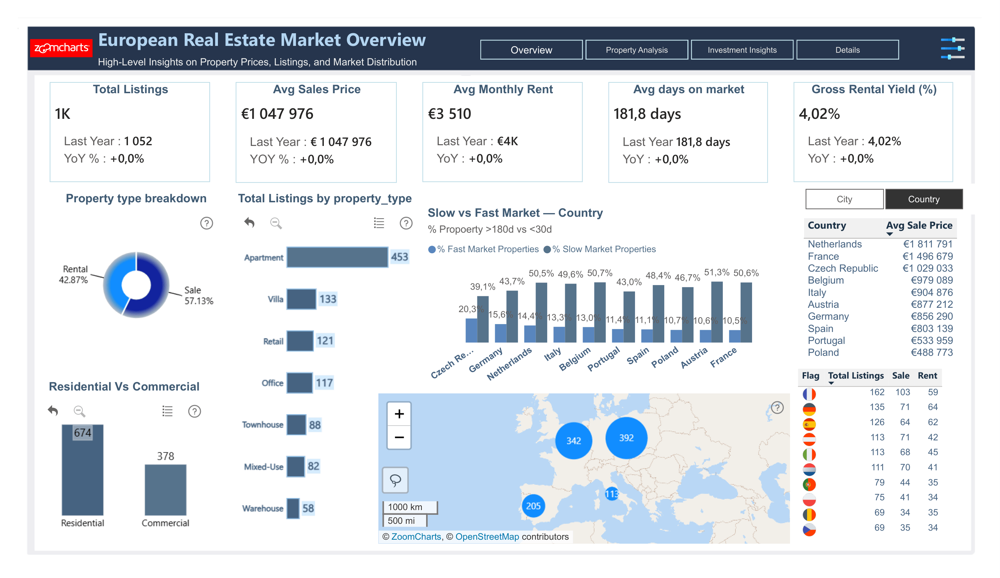
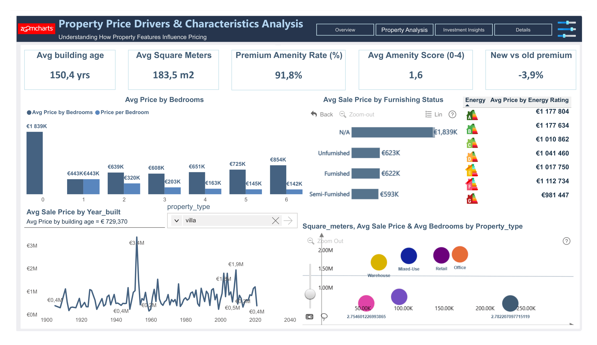
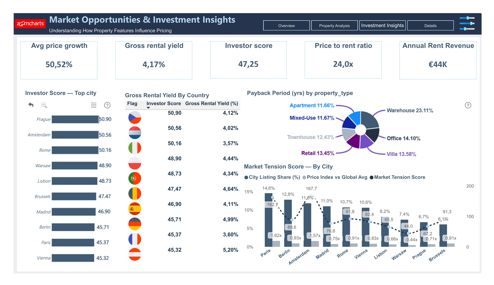

# 🏠 European Real Estate Market Analytics
> **FP20 Analytics × ZoomCharts Data Challenge #36**

[](https://powerbi.microsoft.com)
[](https://learn.microsoft.com/en-us/dax/)
[](https://zoomcharts.com)
[](https://claude.ai)
[](LICENSE)

Interactive Power BI dashboard analyzing European real estate market performance across 12 countries, 48+ cities, and 5,000 property listings (2020–2024). Built for the FP20 Analytics ZoomCharts Challenge #36.

**[🔗 Live Dashboard]([#](https://app.powerbi.com/view?r=eyJrIjoiZjhkMmQyMDMtZWNkNC00NGViLTlmYzItNjljYzk2NTIzZWMxIiwidCI6IjQ2NTRiNmYxLTBlNDctNDU3OS1hOGExLTAyZmU5ZDk0M2M3YiIsImMiOjl9))** &nbsp;|&nbsp; **[💼 LinkedIn Post]([#](https://www.linkedin.com/posts/kadrimohamed_fp20analytics-builtwithzoomcharts-powerbi-share-7449514185375281152-oAur?utm_source=share&utm_medium=member_desktop&rcm=ACoAACSPxgMB05bNKOWLiQnbX9Xy3LNbAQFMfe8))**

---

## 📊 Preview

| Page 1 — Market Overview | Page 2 — Price & Property | Page 3 — Investor Opportunities |
|:---:|:---:|:---:|
|  |  |  |

---

## 🎯 Project Overview

### Business Challenge
Analyze a realistic European real estate marketplace dataset to provide actionable market intelligence for **real estate analysts**, **property investors**, and **marketplace product teams**.

### Key Questions Answered
✅ How do property prices and price per m² vary across countries and cities?  
✅ Which locations and property types have the highest average listing values?  
✅ How do property characteristics (size, bedrooms, bathrooms, building age) influence pricing?  
✅ Do properties with premium amenities (gym, pool, elevator, parking) command higher prices?  
✅ Which properties stay longest on the market, and what factors explain it?  
✅ Are there locations that show high property values but lower market activity?  
✅ Which cities present the most attractive opportunities for real estate investors?

---

## 🏗️ Dashboard Structure

### 📄 Page 1: Market Overview & Geography
High-level overview with geographic intelligence and market trends.

**Key Visuals:**
- 5 KPI Cards with YoY comparisons (Total Listings, Avg Sale Price, Avg Price/m², Avg Days on Market, # Countries/Cities)
- ZoomCharts Choropleth Map: Avg Price/m² by country → drill-down to city
- ZoomCharts Bar Chart: Top 15 cities by Avg Sale Price
- Donut Chart: Sale vs Rent distribution by property type
- Bar Chart: Avg Sale Price by property type
- Line Chart: Listings & price evolution over time
- Bar Chart: Price/m² vs global average by country

**Slicers:** Country · City · Property Type · Listing Type · Year · Date Hierarchy

### 📄 Page 2: Price, Property & Amenities Deep Dive
Deep analysis of property characteristics and amenity impact on pricing.

**Key Visuals:**
- 5 KPI Cards (Avg Square Meters, Avg Building Age, New vs Old Premium %, Avg Amenity Score, Avg Days on Market)
- ZoomCharts Scatter: Surface m² vs Sale Price (color = property type, size = bedrooms)
- ZoomCharts Bar: Avg price by number of bedrooms → drill to bathrooms
- Area Chart: Avg price by year of construction (decade)
- Horizontal Bar: Price premium % by amenity (gym, pool, elevator, parking)
- Grouped Bar: Avg price with/without amenities comparison
- Heatmap Matrix: Avg DOM by Country × Property Type
- Bar Charts: DOM drivers (energy rating, furnishing, floor level)

**Slicers:** Country · City · Property Type · Bedrooms · Energy Rating · Furnishing Status · Floor Number

### 📄 Page 3: Investor Opportunities
Strategic investor analysis with yield, scoring, and opportunity identification.

**Key Visuals:**
- 5 KPI Cards (Gross Rental Yield, Price to Rent Ratio, Investor Score, Avg Price Growth, Annual Rent Revenue)
- ZoomCharts Bar: Investor Score ranking by city
- Bar Chart: Gross Rental Yield by country
- Combo Chart: Price Growth % (bar) + Yield % (line) by country
- ZoomCharts Scatter: Sale Price × Rental Yield quadrant analysis (4 quadrants per city)
- Bar Chart: Market Tension Score by city (high value + slow market)
- Matrix Table: Top 10 investor cities with all KPIs

**Slicers:** Country · City · Property Type · Listing Type · Year

---

## 🧠 DAX Model — 121 Measures, 10 Folders

All measures centralized in a single `_MEASURES_DAX` table for clean organization and stable references.

| Folder | Measures | Description |
|--------|----------|-------------|
| 📊 Overview | 6 | Total listings, # countries/cities, sale/rent split |
| 💶 Price Analysis | 9 | Avg/median price, price/m², rent, growth, total value |
| 📈 Market Activity | 7 | Days on market, slow/fast market signals, High Value Low Activity |
| 🏗️ Property Characteristics | 7 | Surface, bedrooms, bathrooms, building age, floor, price/bedroom |
| ⭐ Amenities Premium | 8 | Price premium % per amenity, avg price with amenities |
| 🏆 Investor Metrics | 5 | Rental yield, investor score, payback period, price-to-rent ratio |
| 📉 KPI Distribution % | 22 | % distribution for gym, pool, elevator, energy rating, floor, furnishing |
| 🕐 Last Year KPIs | 30 | LY values + ∆ absolute + % YoY for all main KPIs |
| 🗺️ Q1–Q2 Location Analysis | 5 | RANKX by country/city, gap vs global avg, top 10 cities |
| 🔬 Q3–Q7 Analytical | 22 | Characteristics vs price, amenity impact, DOM drivers, market tension, investor ranking |


### Key DAX Patterns

**Time Intelligence (stable Calendar Table)**
```dax
LY Avg Sale Price (EUR) =
CALCULATE (
    [Avg Sale Price (EUR)],
    SAMEPERIODLASTYEAR ( '_Calendar_Table'[Date] )
)
```
> ⚠️ Uses `_Calendar_Table` instead of Power BI's auto-generated `LocalDateTable_` — which resets its GUID on every file reopen, breaking all LY measures.

**YoY Variation with sign format**
```dax
% ∆ Avg Sale Price vs LY =
VAR LY = [LY Avg Sale Price (EUR)]
VAR CY = [Avg Sale Price (EUR)]
RETURN IF ( ISBLANK ( LY ) || LY = 0, BLANK (), DIVIDE ( CY - LY, LY ) )
-- Format: +0.0%;-0.0%
```

**Market Tension Score (Q6)**
```dax
Market Tension Score =
VAR PriceIdx = DIVIDE (
    AVERAGE ( 'Dataset'[sale_price_eur] ),
    CALCULATE ( AVERAGE ( 'Dataset'[sale_price_eur] ), ALL ( 'Dataset' ) )
)
VAR DOMIdx = DIVIDE (
    AVERAGE ( 'Dataset'[days_on_market] ),
    CALCULATE ( AVERAGE ( 'Dataset'[days_on_market] ), ALL ( 'Dataset' ) )
)
RETURN ROUND ( PriceIdx * DOMIdx * 100, 1 )
```

**Composite Investor Score (Q7)**
```dax
Investor Score =
VAR Yield    = [Gross Rental Yield (%)]
VAR Liquidity = ( 1 - DIVIDE ( AVERAGE ( 'Dataset'[days_on_market] ), 365 ) ) * 10
VAR Growth    = DIVIDE (
    AVERAGE ( 'Dataset'[sale_price_eur] ) - AVERAGE ( 'Dataset'[last_sold_price_eur] ),
    AVERAGE ( 'Dataset'[last_sold_price_eur] )
) * 100
RETURN ( Yield * 4 ) + Liquidity + ( Growth * 0.5 )
```

**Full Premium vs No Amenity (Q4)**
```dax
Full Premium vs No Amenity (%) =
VAR FullPremium = CALCULATE (
    AVERAGE ( 'Dataset'[sale_price_eur] ),
    'Dataset'[gym] = "Yes",
    'Dataset'[swimming_pool] = "Yes",
    'Dataset'[elevator] = "Yes",
    'Dataset'[parking_spots] > 0
)
VAR NoPremium = CALCULATE (
    AVERAGE ( 'Dataset'[sale_price_eur] ),
    'Dataset'[gym] = "No",
    'Dataset'[swimming_pool] = "No",
    'Dataset'[elevator] = "No",
    'Dataset'[parking_spots] = 0
)
RETURN DIVIDE ( FullPremium - NoPremium, NoPremium ) * 100
```

---

## 💡 Key Insights Delivered

🏙️ **Geographic pricing** — Significant price/m² variation across European markets, with top cities commanding well above the global average benchmark

🏋️ **Amenity premium** — Properties with full premium amenities (gym + pool + elevator + parking) command a measurable price uplift vs no-amenity equivalents

⏱️ **Market duration drivers** — Energy rating class and furnishing status are strong predictors of days on market; Grade A properties sell significantly faster

🏗️ **Building age impact** — Post-2010 new builds command a premium over pre-1980 stock, with variation by country and property type

📍 **High value, low activity** — The Market Tension Score identifies cities where prices are above average but liquidity is below average — a key signal for buyers and investors

📈 **Investor opportunities** — The Risk-Adjusted Return Score ranks cities combining rental yield, liquidity, and price appreciation into a single comparable metric

---

## 🎨 Design System

Three custom SVG backgrounds designed at **1920×1080 Full HD**, each with a distinct identity:

| Page | Theme | Colors | Accent |
|------|-------|--------|--------|
| Page 1 | Dark navy — geographic | `#0A0F1E` base | Gold `#C9A84C` + Teal |
| Page 2 | Deep slate — analytical | `#080E1C` base | Teal `#0D8C6A` + Purple |
| Page 3 | Emerald/gold — investor | `#060E18` base | Gold `#B8922A` + Emerald |

Each background includes pre-mapped content zones aligned to the dashboard layout, sidebar navigation, and header bar.

---

## 🛠️ Technical Implementation

### Tools & Technologies
- **Power BI Desktop** — Report development (1920×1080 canvas)
- **DAX** — 121 custom measures across 10 thematic folders
- **ZoomCharts Drill Down PRO** — Map, Bar, and Scatter visuals with drill-down
- **SVG** — Custom backgrounds designed at Full HD resolution
- **Claude AI + MCP** — AI-assisted DAX workflow connected to Power BI Desktop

### Data Model
- **Architecture:** Flat/star — main fact table + dimension lookup
- **Fact Table:** `Dataset` (5,000 property listings, 25 columns)
- **Dimension Tables:** `Country flag` (country → flag emoji), `_Calendar_Table` (full date intelligence)
- **Relationships:** `Dataset[country]` → `Country flag[Country]` · `Dataset[listing_date]` → `_Calendar_Table[Date]`

### AI-Assisted Workflow
The entire DAX layer was built using **Claude AI connected directly to Power BI Desktop via MCP (Model Context Protocol)**:
- 121 measures created, organized, and debugged without leaving the conversation
- Batch operations for creating 10–20 measures at once
- Automatic diagnosis and correction of broken LY measures after file reopen
- `_MEASURES_DAX` table created and all measures migrated in a single operation

---

## 📂 Repository Structure

```
powerbi-eu-real-estate-analytics/
│
├── README.md
├── LICENSE
├── .gitignore
│
├── dashboard/
│   └── Data_Challenge_36_Real_Estate.pbix
│
├── backgrounds/
│   ├── page1_market_overview.svg      ← 1920×1080 dark navy
│   ├── page2_price_analysis.svg       ← 1920×1080 deep slate
│   └── page3_investor.svg             ← 1920×1080 emerald/gold
│
├── dax/
│   ├── 01_overview.dax
│   ├── 02_price_analysis.dax
│   ├── 03_market_activity.dax
│   ├── 04_property_characteristics.dax
│   ├── 05_amenities_premium.dax
│   ├── 06_investor_metrics.dax
│   ├── 07_kpi_distribution.dax
│   ├── 08_last_year_kpis.dax
│   ├── 09_q1_price_by_location.dax
│   ├── 10_q2_top_locations_types.dax
│   ├── 11_q3_characteristics_vs_price.dax
│   ├── 12_q4_amenities_impact.dax
│   ├── 13_q5_market_duration.dax
│   ├── 14_q6_high_value_low_activity.dax
│   └── 15_q7_investor_city_ranking.dax
│
├── images/
│   ├── page1-market-overview.png
│   ├── page2-price-analysis.png
│   ├── page3-investor.png
│   ├── dax-measures.png
│   └── data-model.png
│
└── docs/
    ├── dashboard-structure.md
    ├── data-model.md
    └── challenge-brief.md
```

---

## 🚀 How to Use

### Prerequisites
- Power BI Desktop (latest version)
- ZoomCharts Drill Down PRO license ([free developer license](https://zoomcharts.com/en/microsoft-power-bi-custom-visuals/))
- Source dataset: [FP20 Analytics Challenge 36](https://fp20analytics.com/live-challenge/)

### Installation

1. Clone this repository
```bash
git clone https://github.com/KADRIMOHAMED/powerbi-eu-real-estate-analytics.git
```

2. Open `dashboard/Data_Challenge_36_Real_Estate.pbix` in Power BI Desktop

3. Update the data source path to point to your local copy of `EU_Real_Estate_Dataset.xlsx`
```
File → Options → Data source settings → Change source
```

4. Activate your ZoomCharts developer license

5. Click **Refresh** — the report is ready

### Navigation
- Use page tabs at the bottom to switch between the 3 pages
- Slicers on each page filter all visuals simultaneously
- Click any visual to cross-filter
- ZoomCharts visuals support drill-down (click into a country → city → property)
- KPI Cards show current value + LY value + YoY trend arrow

---

## 🏆 Challenge Information

Built for the **FP20 Analytics × ZoomCharts Data Challenge #36 — European Real Estate Market Analytics**

### Judging Criteria
- **Intuitive** (15 pts): Clear, visually appealing, tells a story
- **Interactive** (15 pts): Engaging navigation, cross-filtering, drill-down
- **Insightful** (15 pts): Accurate data, meaningful insights, optimized performance

---

## 🤝 Contributing

Feedback and suggestions are welcome!

1. Fork the repository
2. Create a feature branch (`git checkout -b feature/improvement`)
3. Commit your changes (`git commit -m 'Add improvement'`)
4. Push to the branch (`git push origin feature/improvement`)
5. Open a Pull Request

---

## 📝 License

This project is licensed under the MIT License — see the [LICENSE](LICENSE) file for details.

---

## 🙏 Acknowledgments

- **FP20 Analytics** & **Federico Pastor** for organizing the challenge
- **ZoomCharts** for providing Drill Down PRO visuals and the developer license
- **Anthropic / Claude AI** for the MCP-powered DAX workflow
- **Power BI Community** for inspiration and support

---

## 📞 Contact

**KADRI MOHAMED**

[](https://linkedin.com/in/kadrimohamed)
[](mailto:kadrimed95@gmail.com)

---

> 🌟 If you found this project helpful, please give it a star! ⭐

*Built with ❤️ using Power BI · DAX · ZoomCharts · Claude AI + MCP*


